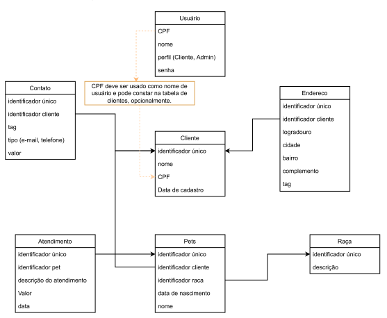

# Projeto Petshop

#### DESCRIÇÃO DO PROJETO
   O projeto consiste na implementação de um sistema de controle e gerenciamento de uma loja Pet Shop. O diagrama UML 
abaixo, foi utilizado como referência para o desenvolvimento do sistema onde usuários com perfil ADMIN tem permissão 
para incluir, excluir, alterar e visualizar qualquer cadastro enquanto usuários com perfil CLIENTE podem visualizar e 
alterar apenas os seus registros e/ou registros dos seus pets.

<div align="center">

</div>

#### TECNOLOGIAS UTILIZADAS
 * Java 17.
 * Lombok.
 * Spring Boot.
 * Spring Data JPA.
 * Banco Relacional PostgreSQL.
 * Flyway.
 * ModelMapper.
 * Spring Security.

#### REQUISITOS ATENDIDOS
* Banco de dados relacional JDK 17 ou superior
* Autenticação por token JWT 
* Autorização role based
* Implementar usando Springboot, Quarkus ou Micronaut
* Versionamento GIT, público.
* Documentação da API (Swagger)

#### INSTRUÇÕES DE USO
Com o PostgreSQL instalado, o primeiro passo para utilizar o sistema desenvolvido é realizar a criação de um banco de dados para que ao executar a aplicação as tabelas sejam criadas automaticamente. Portanto, o seguinte script deve ser executado para realizar criação do banco:
```
CREATE DATABASE petshop_db
    WITH
    OWNER = postgres
    ENCODING = 'UTF8'
    LC_COLLATE = 'Portuguese_Brazil.1252'
    LC_CTYPE = 'Portuguese_Brazil.1252'
    TABLESPACE = pg_default
    CONNECTION LIMIT = -1
    IS_TEMPLATE = False;
```
Com o projeto aberto em sua IDE de preferência, deve-se acessar o arquivo application.properties e atribuir corretamente as variáveis de conexão, sendo elas as informações de usuário e senha do banco e a URL de conexão, onde esta deve ter o seguir o seguinte padrão:

```
spring.datasource.url=jdbc:postgresql://localhost:{Porta-do-banco}/petshop_db

```
Por fim, deve-se utilizar o Maven para realizar o download das dependências e o builder do projeto. Após isso, a aplicação encontra-se pronta para ser inicializada.

**Observação:**
```
Caso o lombok apresente erro, basta acessar o link https://projectlombok.org/download e realizar o download do exceutável.
Logo após, deve ser feito a instalação em sua IDE.
```

### Documentação 
Para acessar a documentação, basta executar a aplicação e acessar a seguinte rota:
```
http://localhost:8080/swagger-ui/index.html
```
Nela está contida a documentação gerada com o auxilio do Swagger, contendo a explicação de cada endpoint da aplicação.
